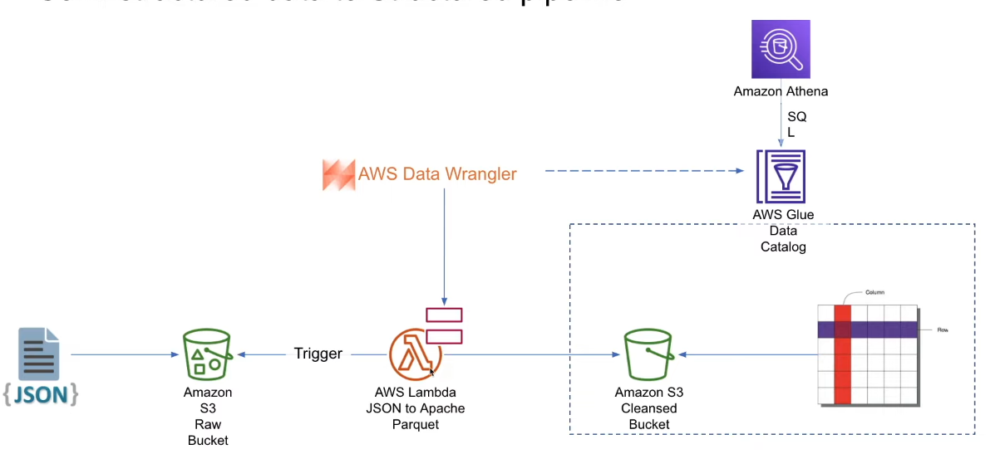

# YouTube Data Analysis for Ad Campaigns

## Project Overview

I created this project to help clients or companies run ad campaigns using YouTube as a source. The key questions I aim to answer are:

- **How can I categorize videos based on comments and statistics?**
- **What factors influence the popularity of a YouTube video?**

## Goals and Success Criteria

- **Data Ingestion**: Efficiently ingest data, both one-off and incrementally.
- **ETL Design**: Extract, transform, and load (ETL) data efficiently.
- **Data Lake**: Design and build a scalable data lake architecture.
- **Scalability**: Ensure the data architecture scales efficiently.
- **AWS Cloud**: Implement cloud-based data storage and processing.
- **Reporting**: Develop a business intelligence dashboard for insights.

## Technology Used

For this project, I used the following technologies:

- **Python**: For data processing and scripting.
- **PySpark**: To process large datasets efficiently.
- **ETL Pipelines**: To extract, transform, and load data seamlessly.
- **Cloud Storage (S3)**: To store raw, cleansed, and processed data.
- **SQL**: For querying and transforming data in the analytics layer.
- **AWS Services**: Athena, Glue, Redshift, S3, IAM, Lambda, Quicksight.

## Project Architecture

### Data Organization

I created two folders:

1. **JSON Data** - Contains category IDs for different regions.
2. **CSV Data** - Contains daily trending YouTube videos.

I use AWS Glue to crawl and extract metadata from JSON files. IAM roles required for this process:

- **AmazonS3FullAccess**: Grants full access to S3.
- **AWSGlueServiceRole**: Allows AWS Glue to interact with S3, CloudWatch, and other AWS services.

## Data Cleaning Process

- **Convert JSON files to column and row format (Apache Parquet)**.
- **Normalize nested JSON fields** to extract relevant data.
- **Handle missing and inconsistent values**.

### AWS Lambda Workflow

1. Triggered by an **S3 event** when a new JSON file is uploaded.
2. Extracts **file details** (bucket & key).
3. Reads the JSON file into a **Pandas DataFrame**.
4. **Normalizes nested JSON data**.
5. Writes transformed data to **S3 in Parquet format**.
6. Registers metadata in **AWS Glue Catalog**.
7. **Handles errors gracefully**.

### AWS Lambda Permissions Needed

- **AmazonS3FullAccess**: Grants full access to Amazon S3.
- **AWSGlueServiceRole**: Provides AWS Glue with necessary permissions.

## Preprocessing Steps 

This is done using pyspark

| Step | Description |
| --- | --- |
| **1. Data Filtering** | Loads only **Canada, US, GB** data using predicate pushdown. |
| **2. Data Type Mapping** | Ensures correct data types for all columns. |
| **3. Resolving Type Conflicts** | Handles inconsistencies in column data types. |
| **4. Removing Null Fields** | Drops records where all values are NULL. |
| **5. Optimizing Output** | Coalesces data, partitions by `region`, and saves as **Parquet** in **S3**. |

## ETL Design

- I created two tables: **Statistics** and **Statistics Reference Data** after cleaning and processing the data.
- I designed an **ETL pipeline** using AWS Glue to join both tables via an **inner join**.
- The final processed data is stored in a **new S3 bucket** and an **analytics database**.

## Analytics and Visualizations

[text](Analytics_visualizations.pdf)

I built a dashboard using **AWS QuickSight** to analyze YouTube video trends. The key insights include:

1. **Count of Likes and Dislikes by Video Title**: This visualization helps assess audience engagement by comparing the number of likes and dislikes on different videos. It highlights which videos received positive or negative reactions.

2. **Sum of Views by Video Category**: This visualization aggregates video views by category (e.g., Music, Entertainment, Gaming) to identify the most popular content genres on YouTube. It provides insights into where advertisers should focus their efforts.

3. **Trends in Comment Count, Views, and Likes**: This visualization tracks user engagement trends over time by analyzing the correlation between views, likes, and comments. It helps understand audience interaction patterns and the types of videos that generate more discussions.

4. **Views Over Time by Region**: This visualization shows the distribution of video views across different regions (e.g., US, UK, Canada) over time. It provides insights into regional content consumption trends and helps in optimizing ad targeting strategies.

These visualizations help in identifying factors affecting video popularity and refining ad campaign strategies.

## Acknowledgments
- Special thanks to [@darshilparmar](https://github.com/darshilparmar) for this project.
